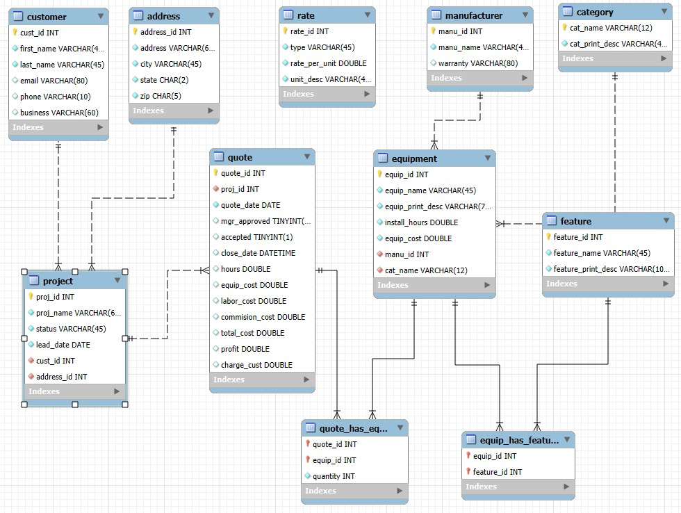
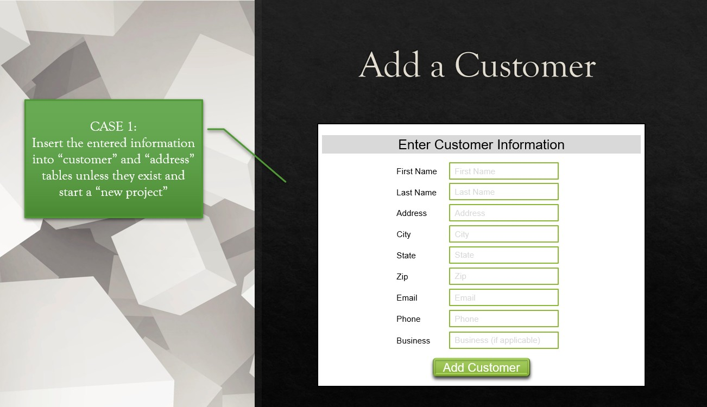
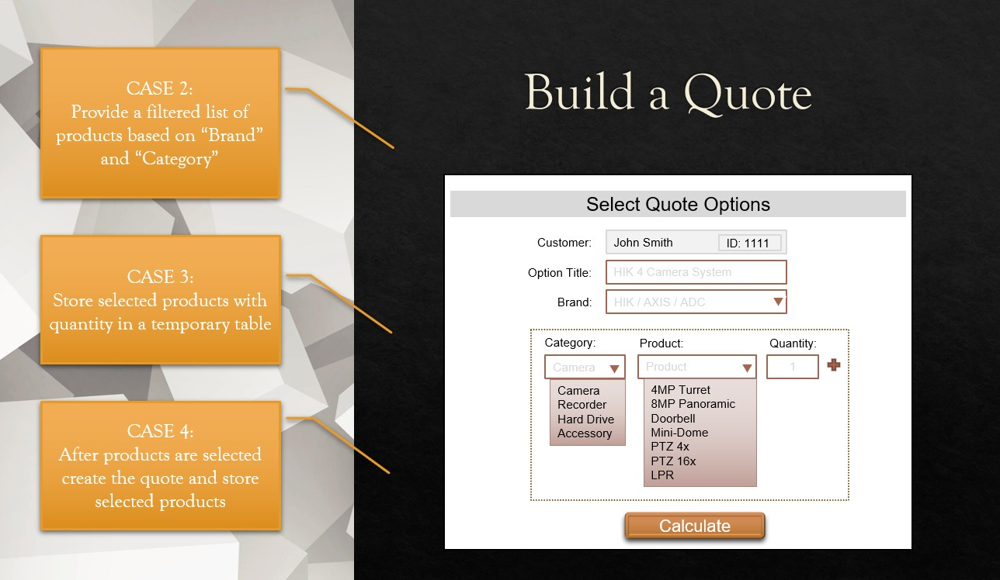
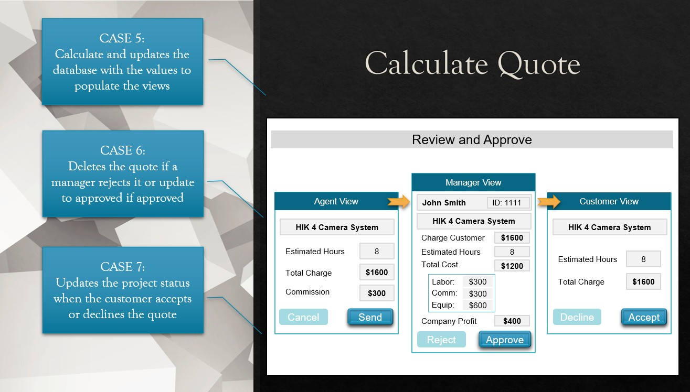
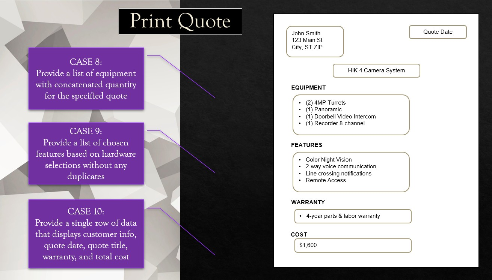

# Customer Quote Application — MySQL Database

> **Skills:** MySQL · Relational Schema Design · Normalization · Stored Procedures · Transactions & Error Handling · Joins (incl. `CROSS JOIN`) · Many-to-Many Modeling · Indexing & Constraints

A relational database designed in **MySQL** to power a customer quoting application for a
security and surveillance equipment installation business. The database models the entire
quote lifecycle — from capturing a new customer lead, to building and pricing a quote, through
a multi-role approval workflow, and finally producing a printable customer quote.

This project focuses on the **data layer**: schema design, normalization, and the server-side
stored procedures that drive each step of the business process.

## Highlights

- **End-to-end business workflow in pure SQL** — lead capture → quote build → multi-role approval → printable quote
- **11 normalized tables** (including 2 junction tables) enforcing integrity with primary/foreign keys, unique constraints, and indexes
- **10 stored procedures** implementing 10 real business-case scenarios, using `IN`/`OUT` parameters
- **Transaction-safe operations** with `EXIT HANDLER` and `SIGNAL` for automatic rollback when a multi-step insert fails
- **Duplicate prevention by design** — enforced at both the schema level (unique keys) and in procedures (existence checks before insert)
- **Rate-driven pricing engine** that computes labor, equipment cost, commission, and profit from reference data

## Demo

**Live Demo — Running the Stored Procedures in MySQL**
Watch the procedures execute against the database and walk through how each is used in its
business case scenario.

▶️ **[Watch the Live Demo on YouTube](https://youtu.be/r3EAzu2SmHo)**

**Design & Database Planning Walkthrough**
A walkthrough of the application mockups and the database design behind them.

📐 **[Watch the Design & Planning Walkthrough on YouTube](https://youtu.be/Sog2CKRYgYI)**

> The live demo shows the actual stored procedures executing. The UI images further down are
> **design mockups** that illustrate the intended application flow.

## Business Problem

When an installation company prepares a customer quote, staff need to capture customer details,
assemble a list of compatible equipment with quantities, calculate labor and cost, route the
quote through internal approval, and present a clean estimate to the customer. This database
supports that end-to-end process while preventing duplicate customer, address, and project
records and keeping pricing logic consistent.

## Planning & Design

A **design-first** project: I designed UI mockups for all 10 business cases (shown per step
[below](#workflow--stored-procedures)), then worked backward — from screens to an ERD to the
schema. 📐 See the [Design & Planning Walkthrough](https://youtu.be/Sog2CKRYgYI) video.

## Database Design

The schema is normalized into related tables connected by primary and foreign keys, with unique
constraints and indexes to enforce data integrity and support efficient lookups. Many-to-many
relationships are resolved with junction tables (e.g. `quote_has_equipment` and
`equip_has_feature`).

Core tables include:

- **customer / address / project** — customer records, their locations, and the project a quote belongs to
- **quote** — quote header with dates, status, cost breakdown, profit, and approval flags
- **equipment / manufacturer / category / feature** — the product catalog and its attributes
- **rate** — pricing/labor rate reference data
- **quote_has_equipment / equip_has_feature** — junction tables linking quotes to products (with quantity) and products to features

## Workflow & Stored Procedures

The application logic is implemented as stored procedures, each handling a step in the quoting
process.

### 1. Add a Customer

Insert customer and address records (reusing existing records when found) and start a new
project, returning the project ID. Duplicate customers, addresses, and open projects are
detected and reused rather than re-created.

_Design mockup: capturing new customer information._

### 2. Build a Quote

Return a product list filtered by brand and category (including universal-fit parts), stage the
selected products and quantities in a temporary table, then create the quote and persist the
selections.

_Design mockup: filtering products and selecting items with quantities._

### 3. Calculate, Review & Approve

Compute labor, cost, commission, profit, and customer charge, then route the quote through an
**agent → manager → customer** flow. Rejected quotes are removed; approved quotes update status,
and the project status updates when the customer accepts or declines.

_Design mockup: the three-role review and approval workflow._

### 4. Print the Quote

Return a consolidated equipment list (with quantities), a de-duplicated feature list, and a
single summary row containing customer info, quote date, warranty, and total cost.

_Design mockup: the final printable customer quote._

## Key SQL Concepts Demonstrated

- Normalized relational schema design with PKs, FKs, unique constraints, and indexes
- Junction tables to resolve many-to-many relationships
- Stored procedures with `IN`/`OUT` parameters
- Transactions (`START TRANSACTION` / `COMMIT`) for safe multi-step inserts
- Conditional logic (`IF`/`ELSE`), declared variables, and duplicate-prevention checks
- Multi-table `JOIN`s, including a `CROSS JOIN` to seed the equipment/feature junction table, plus aggregation and temporary tables
- Use of `LAST_INSERT_ID()` to chain related inserts

## Tech Stack

- **MySQL** (database engine)
- **MySQL Workbench** (schema design / forward engineering)

## Repository Contents

| File                         | Description                                                 |
| ---------------------------- | ----------------------------------------------------------- |
| `create database.sql`        | Schema creation script (tables, keys, constraints, indexes) |
| `insert statements.sql`      | Sample data to populate the database                        |
| `test case - procedures.sql` | Stored procedure definitions for each workflow step         |
| `test case - calls.sql`      | Example procedure calls / test cases                        |
| `images/`                    | ERD diagram and application design mockups                  |

## How to Run

1. Open the scripts in MySQL Workbench (or any MySQL client).
2. Run `create database.sql` to build the schema.
3. Run `insert statements.sql` to load sample data.
4. Run `test case - procedures.sql` to create the stored procedures.
5. Use `test case - calls.sql` to exercise the workflow.

## Future Enhancements

- Extend the transaction/error-handling pattern (already used in `new_project`) to the remaining procedures
- Support editing and deleting existing quotes
- Soft-delete (inactive status) for equipment instead of hard deletes
- Reporting views for sales and project analytics
